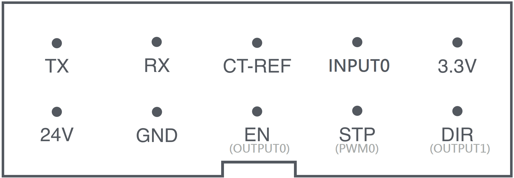

Hardware Extensions
=================================
This guide will show you how to use the extension port to communicates with hardware extensions.

Understanding the extension port
++++++++++++++++++++++++
The extension port is located at the top cap of FLUX Delta. It has 10pins, including - 1 UARTs, 1 stepper motor control, 1 GND, 1 analog output, 3 digital input/output pins, 3.3V and 24V outputs. 

**DESCRIPTION**

	**Tx / Rx** - Used for UART communication.

	**EN / STP / CT-REF / DIR** - Used for stepper motor control.

	**GPIO 1-3** - Digital inputs / outputs.

	**PWM** - Analog outputs.

	**GND** - Ground pin.

	**3.3V** - Can be used for powering MCUs, for example like `Arduino Pro Micro <https://www.sparkfun.com/products/12587>`_. **The maximum current is 3A.**

	**24V** - Can be used for powering heater, drills or other power consuming components. **The maximum current is 3A.**

Developing firmware for hardware extensions
++++++++++++++++++++++++
A typical toolhead uses UART to communicate with its hosting machine. 
::
	//Coming soon!

Communicating with hardware extensions
++++++++++++++++++++++++
::

	//Coming soon! You'll need to use SDK mode of the machine.